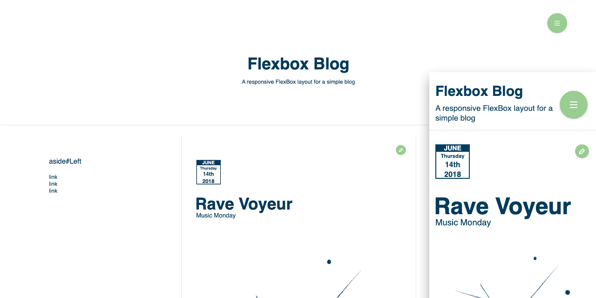
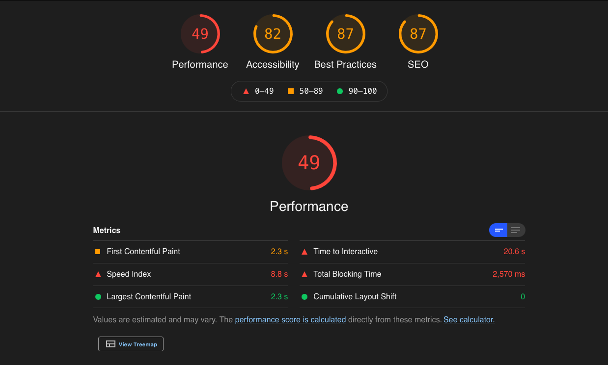
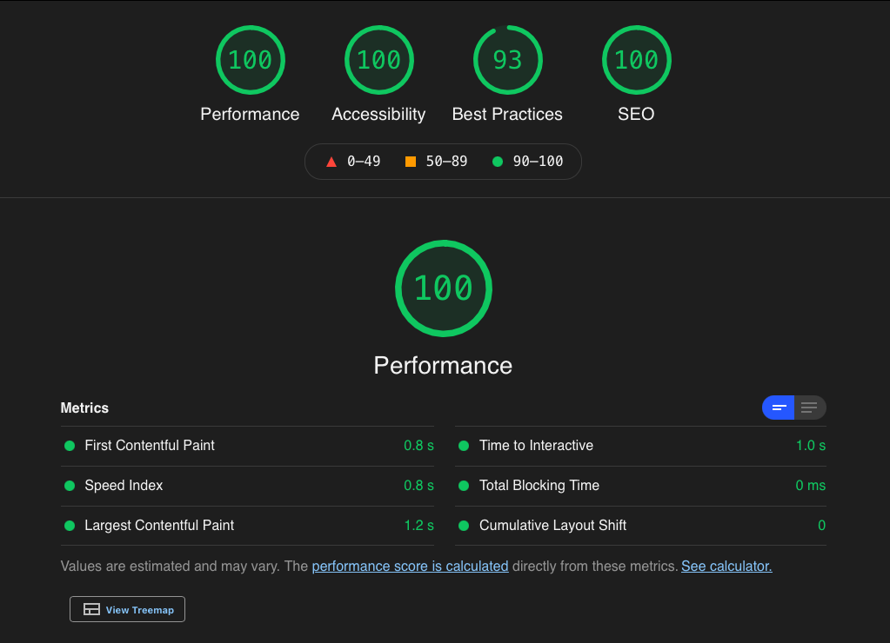

# flexbox-blog

This is a simple blog layout that I created in 2018 to dip my toes into flexbox layouts. I recently re-visited the project and felt it still had some potential, but running it through Lighthouse made it clear that some work needed to be done before I could even consider this as a  potential layout template.

## Initial Lighthouse scores

After seeing these scores I spent a Sunday afternoon making improvements wherever possible and the project is now looking much better.

## Updated Lighthouse scores

To get this project up to speed I did the following:

- re-linked some missing resources
- removed Font Awesome and replaced those icons with .svgs
- Removed the Google Fonts
- Replaced SoundCloud embeds with YouTube Embeds and a facade
- Addressed the some accessibility issues (contrast, heading order, etc.)
- Fixed some small markup issues.

The project could still use some adjustments to make it truly template ready. I don't love that it uses jQuery for the dropdown menus, and the stylesheet can definitely be greatly reduced in size.

I've also opened an issue to verify the semantics of the markup